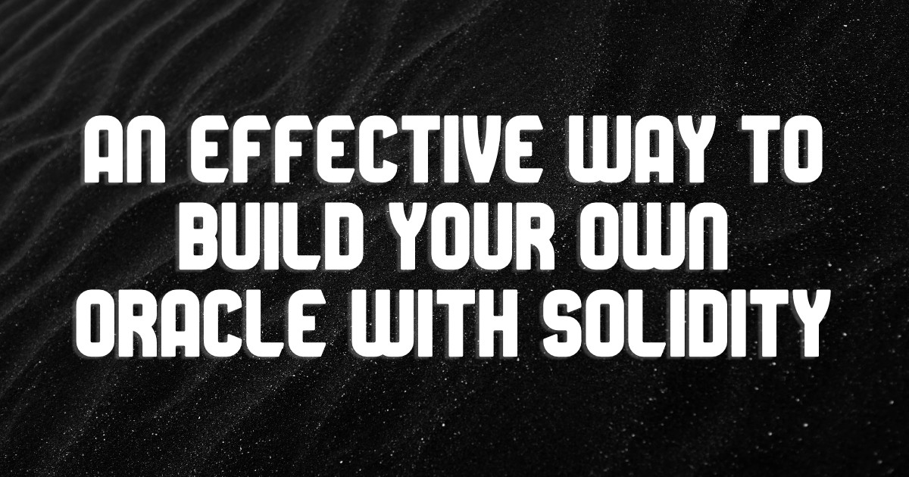
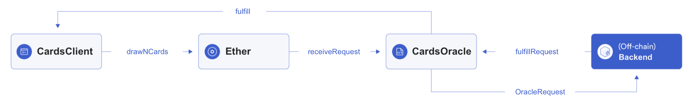

<!--
  Title: Minimal Viable Oracle (MVO) - An effective way to Build your own oracle with Solidity
  Description: Connect your Ethereum smart contract to any real world API using the oracle pattern!
  -->

# Minimal Viable Oracle (MVO) - An effective way to Build your own oracle with Solidity

[](https://github.com/noahliechti/minimal-viable-oracle/blob/main/LICENSE)
[](http://twitter.com/intent/tweet?text=Check%20out%20%40noahliechti%27s%20Minimal%20Viable%20Oracle%20%28MVO%29.%20A%20way%20to%20connect%20your%20Ethereum%20smart%20contract%20to%20any%20real%20world%20API%20using%20the%20oracle%20pattern%21&url=https://github.com/noahliechti/minimal-viable-oracle)
[](https://github.com/noahliechti/minimal-viable-oracle/fork)



Smart contracts cannot access off-chain data directly. This repository demonstrates how to connect Ethereum to any real world API using the oracle pattern.

If you have built a smart contract before, you may already know how to query information like price feeds or random numbers into your contract. But how about external data that is not provided by the common oracle providers in the Web3 space?

In this tutorial we will create a set of contracts that will enable you to draw `n` random cards from a standard 52-card deck.

## Setup

1. [Fork](https://github.com/noahliechti/minimal-viable-oracle/fork) the project and clone it to your local environment.
2. Install all the packages with `npm i`.
3. Create a `.env` file and define the environment variables `ALCHEMY_API_KEY_RINKEBY`, `ETHER_SCAN` and `PRIVATE_KEY`. There is an example in `.example.env`.
4. Open three tabs in the console.
5. In the first tab run `npx hardhat run scripts/1_deploy-contracts.js --network rinkeby`. This will deploy both contracts and verify them on [etherscan](https://rinkeby.etherscan.io/). The process might take up to three minutes. This script will also create a file called `map.json` that keeps track of the addresses of the deployed contract. It may not work on Windows. If this is the case, create the `map.json` file and insert the addresses of the deployed contracts manually. You can get inspired by `map.example.json`. Without this file the next scripts won't work.
6. In the second tab run `npx hardhat run scripts/2_listen-to-oracle-requests.js --network rinkeby`. As discussed above, this script is responsible for fetching the data and sending it to the oracle contact. It runs in the background and won't log anything.
7. In the third tab run `npx hardhat run scripts/2_listen-to-client-fulfillments.js --network rinkeby`. This script listens on the `ClientFulfillment` event from the `CardsClient` contract.
8. Now it gets exciting! Run `npx hardhat run scripts/3_draw-cards.js --network rinkeby` in the first tab, which we used before to deploy the contracts. This script triggers the whole "oracle flow" and will draw 52 cards from a single deck without shuffling. You can adjust the number of cards to your liking. Make sure you have some testnet Ether in you wallet, since every every request sends 0.001 ETH to the oracle.
9. If you did everything correctly the third tab logs an array of 52 cards.

## Project constraints

### Minimum Requirements

- Use the [deckofcardsapi.com](https://deckofcardsapi.com/) API
- A request from the client contract `CardsClient` costs 0.001 ETH
- The `CardsClient` contract has a callback function named `fulfill`
- The callback function should only be callable by the `CardsOracle` contract
- `CardsClient` only allows for one pending request
- Drawn cards are encoded as `bytes2` (Ace of Spades -&gt; `AS` -&gt; `0x4153`)
- When the `CardsOracle` receives a request via the `receiveRequest` it fires the `OracleRequest` event
- The backend must listen to the `OracleRequest`, query the API and send the result back to the `CardsOracle` via `fulfillRequest` function
- The `fulfillRequest` function is only callable by the backend

### Recommended Stack

- Hardhat
- Ethers.js
- Solidity
- Node.js

## Implementation

If you are up for a challenge try to implement the oracle yourself. If not I will be more than happy to help you implement the project. Here is the [final code](https://github.com/noahliechti/minimal-viable-oracle). It is a fully functioning project. I recommend opening the code in a separate tab while reading through this article.

### How Do Oracles Work?

To fulfill their core purpose, smart contracts may need to communicate with the outside world. Oracles enable this functionality. To do this, an oracle is made up of an on-chain component (smart contract) and an off-chain component that can query the API. The backend then periodically sends transactions to update the smart contract's state. It is important to understand that **your contract is asking the oracle to make the API call for you. It doesn't make the call itself.**

There are two reasons to use an oracle:

1. You rely on information that can not be provided from within the blockchain.
2. You rely on information to be served at a specific time in the future.

### Architecture



### Smart Contracts

My implementation consists of two contracts and one interface. The contract that interacts with the oracles is called `CardsClient` and the on-chain component that provides this service is called `CardsOracle`. The contracts were compiled with version `0.8.7` and should also work until version `0.8.15`.

#### CardsClient

To get an overview I'll show you the state variables and constructor of the `CardsClient` contract.

```plaintext
contract CardsClient {
    address public owner;
    address payable public oracle;
    bytes2[] public cards;
    uint32 public pendingRequestId;
    // events and modifiers...
    constructor(address payable _oracle) {
        owner = msg.sender;
        oracle = _oracle;
    }
    // more code...
}
```

The `owner` is the address which created the contract. There can be multiple such client contracts, since everybody is allowed to use our oracle. The address of the oracle needs to be `payable` because we pay the oracle 0.001 ETH for every request we make. The reason for the fee is that the oracle has to make a secondary transaction to the `CardsClient` contract which costs gas. The results of our request will be stored in an array of `bytes2` variables. Every card can be efficiently represented in two bytes of storage (Ace of Spades -&gt; `AS` -&gt; `0x4153`). Finally we will use a `uint32` to store the ID of the latest pending request. This implementation prevents multiple simultaneous requests. You could also allow multiple simultaneous requests, but for the purposes of this tutorial, I'm keeping it simple.

---

Next we are going to define the functions, which a Externally Owned Account (EOA) or contract could interact with.

```plaintext
function drawNCardsWithShuffle(uint8 _nrOfCards) public payable returns (uint32){
    return drawNCards(_nrOfCards, true);
}

function drawNCardsWithoutShuffle(uint8 _nrOfCards) public payable returns (uint32){
    return drawNCards(_nrOfCards, false);
}

function drawNCards(uint8 _nrOfCards, bool shuffle) internal returns (uint32){
    // implementation follows...
}
```

There are two public functions named `drawNCardsWithShuffle` and `drawNCardsWithoutShuffle`. The former function will draw a card from a shuffled deck and reshuffle before any subsequent card draw. The probability to draw a specific card will remain `1/52`. The latter function will draw cards from the same deck without reinserting the cards afterwards. Both functions start with a new and shuffled deck on every request.

The `drawNCardsWithShuffle` and `drawNCardsWithoutShuffle` function create a level of abstraction. A user will never call the `drawNCards` function directly. Which is why it is `internal`.

All functions use a `uint8` as the datatype for the `_nrOfCards` parameter, because it is the smallest `uint` that is capable of storing the number 52.

---

In order to reuse functionality between the `CardsClient` and the `CardsOracle` contracts, we define an interface that declares a struct called `Request`.

```plaintext
interface IOracle {
    struct Request {
        uint8 nrOfCards;
        bool shuffle;
        address cbClient;
        bytes4 cbSelector;
        bool fulfilled;
    }
}
```

This struct acts as a new data type. It groups multiple attributes into a single "object". With the fields `nrOfCards` and `shuffle` we are already familiar with. In `cbClient` we will store the address of the contact that calls the oracle. Together with `cbSelector` the oracle can use the low-level `call` function to pass the results of the API back to our `CardsClient` contract. To prevent already fulfilled requests from being maliciously overwritten we can keep track of the state with the `fulfilled` field.

---

`drawNCards` is responsible for transferring ether and the `Request` struct to the oracle.

```plaintext
contract CardsClient is IOracle {
    // more code...
    function drawNCards(uint8 _nrOfCards, bool shuffle) internal returns (uint32){
        require(pendingRequestId == 0, "There is already a pending request");

        Request memory request = Request(_nrOfCards, shuffle, address(this), this.fulfill.selector, false);
        (bool success, bytes memory data) = oracle.call{value: msg.value}(abi.encodeWithSignature("receiveRequest((uint8,bool,address,bytes4,bool))", request));

        if(!success) {
            revert("Call to Oracle was not successful");
        }
        return pendingRequestId = abi.decode(data, (uint16));
    }

    function fulfill(uint32 _requestId, bytes2[] calldata _cards) external {
        // implementation follows...
    }
    // more code...
}
```

After we check that there is no pending request we can create a `Request` and initialize it. `address(this)` is the `cbClient` and `this.fulfill.selector` the `cbSelector`. If you look closely, I added the signature of the `fulfill` function. This is the function the oracle contract will call and pass the results of the off-chain API query. `this.fulfill.selector` returns the first left four bytes of the Keccak-256 (SHA-3) hash of the signature of the `fulfill` function.

Now that the request is constructed, it is time to pass it to `CardsOracle`. In order to successfully execute the transaction, the `call` function forwards all ether that the contract received via `drawNCardsWithShuffle` or `drawNCardsWithoutShuffle`. The recipient of the funds and the struct is the `receiveRequest` function from the oracle. In the first argument of the `abi.encodeWithSignature` function it is mandatory to use two opening and closing parentheses since we are using a struct. Otherwise the argument won't be encoded correctly.

> To learn more about the `call` function check out this [source](https://solidity-by-example.org/call).

The transaction to `receiveRequest` from the `CardsOracle` contract will trigger an event that lets the backend know it should query the API. \*\*Therefore the `data` variable won't include the result of the API call. \*\*Only the fallback function (in our case `fulfill`) gets access to the results. It will be called from the oracle by a transaction that is initiated by the backend.

If the `call` is not successful the transaction reverts. If it is successful the request ID is extracted from the `data` variable, stored in `pendingRequestId` and then returned.

---

The `fulfill` function is the callback function that receives the result from the off-chain service.

```plaintext
contract CardsClient is IOracle {
    // more code...
    event ClientFulfillment(uint32 indexed requestid, bytes2[] cards, address indexed sender, uint256 indexed timestamp);
    // more code...
    function fulfill(uint32 _requestId, bytes2[] calldata _cards) external {
        require(msg.sender == oracle, "Caller is not the oracle");
        assert(_requestId == pendingRequestId);

        emit ClientFulfillment(_requestId, _cards, msg.sender, block.timestamp);

        pendingRequestId = 0;
        cards = _cards;
    }
    // more code...
}
```

When the `fulfill` function gets called it first checks if the caller matches the address that we saved in the `oracle` state variable. This is very important. Otherwise any EOA or contract could call this function and maliciously provide wrong information. Our function also checks that the passed `_requestId` is the same as our state variable `pendingRequestId`. **I use an** `assert` statement since this is a condition that should always be true.

We also emit an event called `ClientFulfillment`. It is not really necessary, but useful to track and test our contract.

In our case the function just stores the result to a state variable `cards`. But it could also trigger an internal logic depending on the `requestId`. This all depends on the use case.

#### CardsOracle

As with the `CardsClient` contract, I provide you an overview of the state variables and constructor.

```plaintext
contract CardsOracle is IOracle {
    address public owner;
    uint256 public fee;
    uint32 public requestId;
    bool public stopped;
    mapping(uint32 => Request) public idToRequest;
    // events and modifiers...
    constructor() {
        owner = msg.sender;
        stopped = false;
        requestId = 1;
        fee = 0.001 * 10 ** 18; // 0.001 ETH
    }
    // more code...
}
```

The `owner` is the contract deployer. The `fee` is the amount that a requester has to pay to the oracle to use its service. It should at least cover the gas fees for the secondary transaction. Every request has its own ID. The `requestId` gets incremented by one on every request. In an emergency scenario where the API gets hacked we need to prevent users from making requests. With `stopped` we can stop the contract temporarily. The `idToRequest` mapping caches the requests. This has two reasons. Firstly we need to store the address and signature of the callback function, secondly there must be a mechanism that a request can't be fulfilled multiple times. We use the `fulfilled` field for this.

> We deploy the `CardsOracle` contract first so that we can directly pass its address to the constructor of `CardsClient`.

---

The `receiveRequest` function receives the requests along with the fee and fires an event.

```plaintext
function receiveRequest(Request calldata _request) external payable notStopped returns (uint32){
    require(msg.value >= fee, "Please send more ETH");
    require(_request.nrOfCards > 0 && _request.nrOfCards < 53 && _request.cbClient != address(0) && _request.cbSelector != bytes4(0) && !_request.fulfilled, "Invalid input data");

    idToRequest[requestId] = _request;

    emit OracleRequest(requestId, _request.shuffle, _request.nrOfCards, msg.sender, block.timestamp);
    return requestId++;
}
```

The `receiveRequest` receives a `Request` as a parameter. The function checks if the contract is not stopped and all fields are properly filled. If not, it reverts. Also the amount of ether the user sends must be greater or equal to the fee we specified. There is no refund if the user pays too much. All requests are stored in our `idToRequest` mapping. The requests can be accessed by their `requestId`.

Next we emit the `OracleRequest` event. Our backend listens for this event and queries the data from the API. It is important that the event gets emitted from the `CardsOracle` contract. If we would allow any contract to emit the event the oracle would be vulnerable to spam since we can not ensure that the user has paid for the service.

The function ends with a return statement that returns the current `requestId` to the caller contract and increments the ID afterwards. This is useful, because the `CardsClient` contract may want to associate incoming calls by their ID.

---

The following function can only be called by the backend. Its responsibility is to pass the fetched data to the callback function of the `CardsClient` contract.

```plaintext
function fulfillRequest(uint32 _requestId, bytes2[] calldata _cards) notStopped onlyOwner external {
    Request storage request = idToRequest[_requestId];

    assert(request.cbClient != address(0));
    assert(!request.fulfilled);
    assert(_cards.length == request.nrOfCards);

    request.fulfilled = true;

    emit OracleFulfillment(_requestId, _cards, msg.sender, block.timestamp);
    (bool success, ) = request.cbClient.call(abi.encodeWithSelector(request.cbSelector, _requestId, _cards));
    require(success, "Couldn't fulfill request");
}
```

With the `_requestId` that we receive as a parameter we are able to access the cached requests. The `_cards` parameter stores the drawn cards. In order to successfully pass the `_cards` to the client several conditions have to be met:

1. The contract must not be stopped
2. The request must exist in the `idToRequest` mapping
3. The request must not be already fulfilled
4. The number of requested cards has to be equal to the number of cards that the function received

Afterwards we can again use the low level `call` function. In this case we pass the encoded data and the `_requestId`.

We use the [Checks Effects Interactions](https://fravoll.github.io/solidity-patterns/checks_effects_interactions.html) pattern here, although it isn't strictly necessary.

### Data Source

I wrote several scripts with hardhat to make the project work:

- [1_deploy-contracts.js](https://github.com/noahliechti/minimal-viable-oracle/blob/main/scripts/1_deploy-contracts.js)
- [2_listen-to-client-fulfillments.js](https://github.com/noahliechti/minimal-viable-oracle/blob/main/scripts/2_listen-to-client-fulfillments.js)
- [2_listen-to-oracle-requests.js](https://github.com/noahliechti/minimal-viable-oracle/blob/main/scripts/2_listen-to-oracle-requests.js)
- [3_draw-cards.js](https://github.com/noahliechti/minimal-viable-oracle/blob/main/scripts/3_draw-cards.js)
- [helper-functions.js](https://github.com/noahliechti/minimal-viable-oracle/blob/main/scripts/helper-functions.js)

Although all parts are important for the project to work, only the `2_listen-to-oracle-requests.js` script is needed to listen to the `OracleRequest` event and fetch the data.

```javascript
const cardsOracle = await ethers.getContractAt(
  contractName,
  deployedContractAddress
);

cardsOracle.on(
  "OracleRequest",
  async (requestId, shuffle, nrOfCards, sender, timestamp) => {
    const allCardCodesHex = await getCards(nrOfCards, shuffle);
    let tx = await cardsOracle.fulfillRequest(requestId, allCardCodesHex);
    await tx.wait();
  }
);
```

`cardsOracle` references the deployed `CardsOracle` contract that is deployed on the blockchain. The `on` method of a contract allows us to define an event we want to listen to and an action that should be executed when the event gets fired. We use the `OracleRequest` event, since this is the event we defined in the `receiveRequest` function of the `CardsOracle` contract. When an event happens the script gets access to all the parameters that were defined in the contract. To fetch the appropriate data we need to pass the `nrOfCards` and `shuffle` parameters to the `getCards` function. This function makes the call to the [deckofcardsapi.com](https://deckofcardsapi.com/) API and returns an array of cards in hexadecimal format as a result. This array (`allCardCodesHex`) then gets passed with the `requestId` back to the contract. The data will then be forwarded to the fallback function of the client contract.

If you are interested on how I fetched the data from the API in the `getCards` function take a look at [2_listen-to-oracle-requests.js](https://github.com/noahliechti/minimal-viable-oracle/blob/main/scripts/2_listen-to-oracle-requests.js#L30).

## Expand The Project

A great way to test your knowledge is to extend the project's functionality. Here is some inspiration:

- Create a new ERC-20 Token and use it to pay the oracle.
- Make a dApp where users can bet on what card gets drawn next.
- Create a contract that allows people to play blackjack.
- Use [Chainlink VRF](https://docs.chain.link/docs/chainlink-vrf/) instead of the centralized [deckofcardsapi.com](https://deckofcardsapi.com/) API.

I hope you had fun so far and learned something new!

---

**Disclaimer:** This code has not been professionally audited. Use at your own risk. Also keep in mind that centralized oracles are a point of failure. Always use decentralized oracles if possible. This project is only tested on macOS
